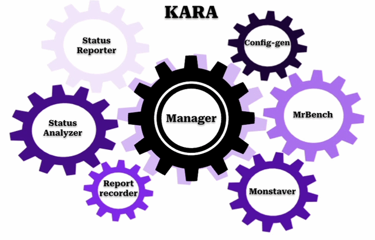

‪<h2>Kara</h2>
<h3>open stack swift performance and monitoring tools</h3>

    
      
      
    1. installing kara:
        Step 1: Installing CosBench First, you need to install the CosBench tool. For familiarization and installation guidance, you can refer to the document Cloud_Object_Storage_Benchmark_(COSBench).
            After installation, go to the main directory and make the cli.sh script executable with the following commands, and create a soft link in the /usr/bin path:
                sudo chmod +x /home/user/cosbench/0.4.2.c4/cli.sh
                sudo ln -s /home/user/cosbench/0.4.2.c4/cli.sh /usr/bin/cosbench
      
        Step 2: Cloning the latest version of the program from OpenGit
            git clone https://opengit.ir/smartlab/kara
            
        Step 3: Operating system settings Create a dedicated user for Kara in mc and all servers of Hyola, or in specific cases, use existing users with sudo access:
            adduser kara
            Edit the sudoers file and grant permission to the user running Kara on the host server and Hyola servers to execute sudo commands without a password:
                # visudo
                %sudo ALL=(ALL:ALL) ALL
                kara ALL=(ALL) NOPASSWD: ALL
   
        Step 4: Running the configure tool After completing the previous steps, go to the manager directory and run the configure program to execute some prerequisite processes and install Kara:
            bash configure.sh
            
        Step 4-1: Installing prerequisite libraries
                Note: Only if the configure tool fails to install them, proceed with installing these on the Kara server:
                apt install -y python pip
                pip install pytz datetime matplotlib pandas alive_progress BeautifulSoup4 wikitextparser mwparserfromhell sshpass

    2. Post-Installation Processes:

        2.1. Changes to the MC docker-compose File
            In some of Kara's reports from Hyola servers, it is necessary to capture images from Grafana. For this, installing the Grafana image renderer plugin is essential. To install the image renderer plugin for Grafana, the following should be added to the main docker-compose file of the MC server.
        
            Note: For the recommended version 3.5.0, you need Grafana version 7.0.0 or higher. Grafana may not be fully compatible with older versions of InfluxDB in its newer versions. To solve this issue, the highest recommended version of Grafana for maximum compatibility with the image renderer plugin, InfluxDB, and Kara is version 9.3.6.

            image_renderer:
              image: grafana/grafana-image-renderer:3.5.0
              container_name: grafana-image-renderer
              hostname: renderer
              restart: always
              environment:
                - ENABLE_METRICS=true
                - HTTP_PORT=8081
                - RENDERER_LOG_LEVEL=debug
              ports:
                - 8081:8081
              networks:
                - mcnet
                
        2.2. Software Installation on Hyola Servers
            This package must also be installed on Hyola servers so that information about the xfs file system is captured and stored in the output documentation.
            apt install xfsprogs
            
        2.3. Changing the Shard in the Database
                After the initial setup of Kara using one of the two mentioned methods, go to the /manager/db_shard directory and first configure the db_shard.conf file according to the MC servers or InfluxDB host servers to change the shard to a 1-hour data storage interval. This increases performance and accuracy during backup and reporting processes in Kara and only needs to be done once. Once this section is executed by the db_shard_script.py tool, the shard in all specified databases will be changed to 1 hour.

            Note: After changing the shard in the database, you must wait at least 2 hours for proper data storage, and after that, you can run other Kara tools related to the database.
        
            database_info: # this part of the config is for changing shard hour in databases
              mc:
                ip: 0.0.0.0
                ssh_port: 22
                ssh_user: user
                container_name: influxdb
                databases: # list of databases
                  - opentsdb
              
            Running the Tool:
            python3 db_shard_script.py

    
