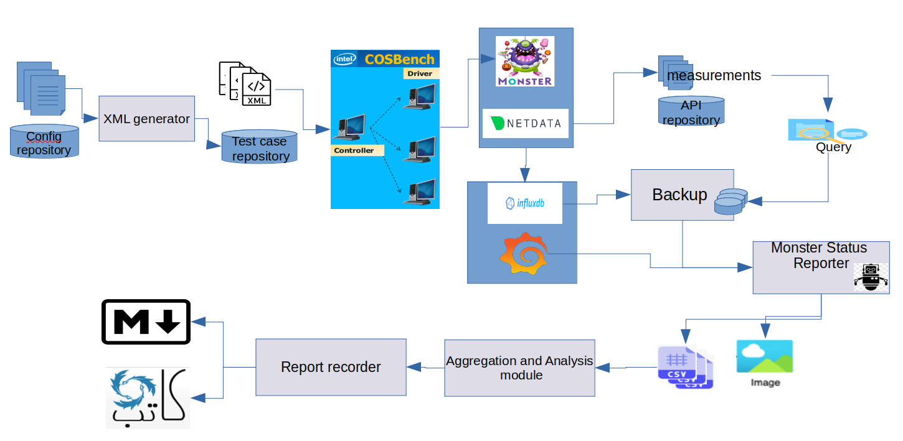

# KARA
‪<h2>Monster Performance Kit</h2>

    # Attention ! after clone repository, please remove (.placeholder) files inside ./result/ 
        1 - Installing the COSBench Benchmarking Software
            In the first step, the COSBench tool needs to be installed. For installation guidance, refer to the Cloud Object Storage Benchmark page.
            After installation, go to the main directory and use the following commands to make the cli.sh script executable and create a soft link in the /usr/bin path.
            sudo chmod +x /home/user/cosbench/0.4.2.c4/cli.sh
            sudo ln -s /home/user/cosbench/0.4.2.c4/cli.sh /usr/bin/cosbench
        
        2 - Installing the KARA Toolset
        
            2.1 - Installing Tool Prerequisites:
                pip install pytz datetime matplotlib pandas alive_progress BeautifulSoup4
                
            2.2 - Cloning the Latest Version of the Program from GitHub:
                git clone https://github.com/m-taghva/KARA
                
            2.3 - Project Directory Description:
                The existing and required directories in the project: 
                monstaver: Backup and restore tool for the database
                status_reporter: Reporting tools from the database
                analyzer: Analysis and aggregation of reports taken in CSV format
                config_gen: Test execution and test configuration tools
                mrbench: Test execution tools
                report_recorder: Documentation tools for test results in the Katib system
                manager: Management tool for the set, configuration files, and tool prerequisites
                results: Location for storing test results and reports
                configure: Auxiliary tools
                
            2.4 - Operating System and SSH Settings:
                Edit the sudoers file and give permission to the user running KARA to execute sudo commands without a password:
        
                # visudo
                    > user ALL=(ALL) NOPASSWD: ALL
                Create an SSH key for the desired user on all Hiola and MC servers, as well as the server running KARA, so that no password is needed for SSH login:
        
                # adduser
                # ssh-keygen (make sure the new key is just for the new user and his .ssh directory)
                # ssh-copy-id -p <port> user@ip
                
            2.5 - Running the configure tool:
                After installing the prerequisites and cloning the repository, the configure.sh tool in the manager directory needs to be run to execute some prerequisite processes and install KARA.
        
                # bash configure.sh
            2.6 - Tool Logs:
                    The path and log file for all tools are the same and equal to var/log/kara/all.log/. In more advanced tools with a configuration file, it is possible to change the log display level between debug - info - warning - error -    critical. For simpler tools without a configuration file, the log display level is debug.
       
